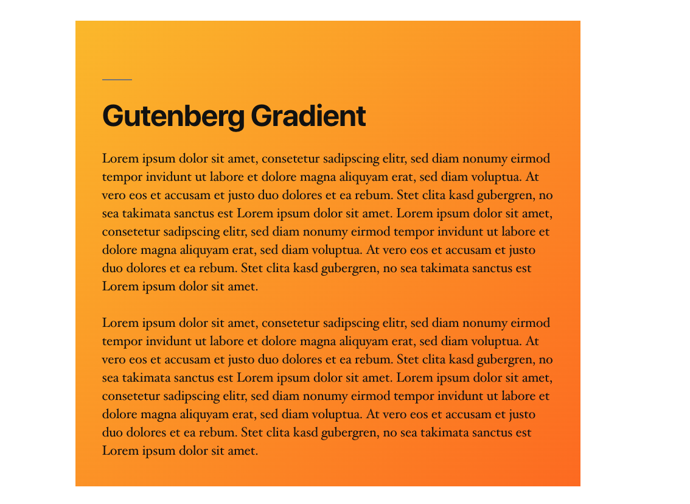
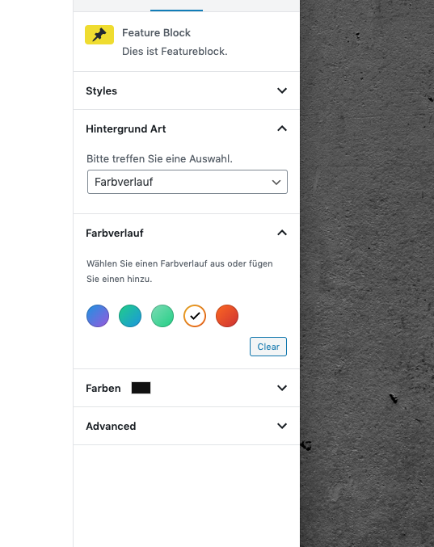
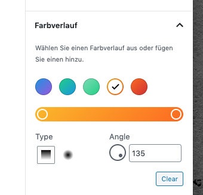
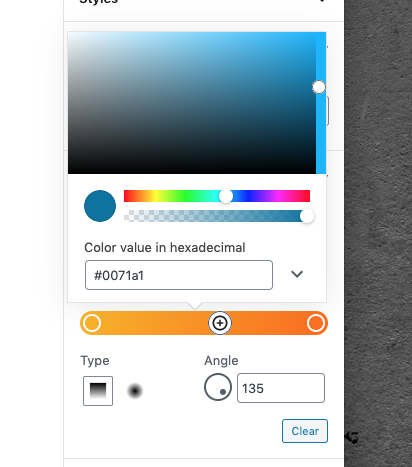

# Farbverlauf – Component

## Einstieg

Vorerst sei gesagt, diese Funktion ist noch WIP. Allerdings ist es tatsächlich schon im WordPress Core drin. Also können wir erstmal ohne Bedenken verwenden. In diesem Tutorial wollen wir folgendes schaffen. 



Sieht auf jeden Fall nicht kompliziert aus, allerdings dies zu entwickeln braucht man tatsächlich etwas Gutenberg Erfahrung. Allerdings bietet die Funktion einfache Parameter an, die man als Gutenberg Entwickler schon weiß. 

### Attribute anpassen

Als erstes registrieren wir einen neuen Block und geben folgende Attribute mit:

```jsx
// GradientColor
bgGradient:{
    type: 'string'
}
```

### Component importieren

Als erstes müssen wir das Component importieren. Es liegt leider nicht unter **wp.components**, sondern unter **wp.blockEditor**. 

```jsx
import { 
	__experimentalGradientPicker as GradientPicker 
} from '@wordpress/block-editor'; 
```

Die Funktion die wir brauchen heißt: **\_\_experimentalGradientPicker** allerdings ist es wie bereits erwähnt eine **Testvariante** im WordPress Core. Damit ich allerdings übersichtlich damit arbeiten kann, habe ich den Schlüsselbegriff **"as"** eingegeben, sodass ich einen eigene Funktionsnamen vergeben kann. In diesem Fall habe ich es **GradientPicker** genannt. 

Innerhalb der Return Funktion rufe ich dann im React DOM die Funktion. 

```jsx
<GradientPicker
    className="gradient__picker"
    value={attributes.bgGradient}
    onChange= { ( data ) => {
        setAttributes({
            bgGradient: data
        });
    }}

    // disableCustomGradients={true}
    // clearable={ false }
/>
```

Wie man hier sieht sind hier die bekannten Parameter von Gutenberg & React wiederverwendet. Mit ClassName kann man eine individuelle Klasse vergeben und beim **value** sind die gespeicherte Attribute, wo tatsächlich der fertige Background CSS Code vom Farbverlauf hinterlegt wurde. 

Beim OnChange holen wir uns vom Event, sobald der User einen Farbverlauf ausgewählt hat die gesamten Werte und speichern es in dem Attribut. 

Der Befehl **disableCustomGradients** kann angegeben werden, wenn man tatsächlich keine eigene Farbverläufe bearbeiten möchte. Somit hat der User keine Erlaubnis dazu. 

Der Befehl **clearable** ist einfach ein Button, der angezeigt wird, wenn man alle Einstellungen zurücksetzten möchte. 



### Globale Verläufe

Natürlich kann man auch globale Einstellungen vornehmen und die in der Palette anbieten. Es handelt sich hier wieder um einem Theme Support, der im Theme oder im Plugin aktiviert werden kann. Der Befehl wäre **editor-gradient-presets**

```jsx
add_theme_support(
   'editor-gradient-presets',
   array(
       array(
           'name'     => __( 'Vivid cyan blue to vivid purple' ),
           'gradient' => 'linear-gradient(135deg,rgba(6,147,227,1) 0%,rgb(155,81,224) 100%)',
           'slug'     => 'vivid-cyan-blue-to-vivid-purple'
       ),
       array(
           'name'     => __( 'Vivid green cyan to vivid cyan blue' ),
           'gradient' => 'linear-gradient(135deg,rgba(0,208,132,1) 0%,rgba(6,147,227,1) 100%)',
           'slug'     =>  'vivid-green-cyan-to-vivid-cyan-blue',
       ),
       array(
           'name'     => __( 'Light green cyan to vivid green cyan' ),
           'gradient' => 'linear-gradient(135deg,rgb(122,220,180) 0%,rgb(0,208,130) 100%)',
           'slug'     => 'light-green-cyan-to-vivid-green-cyan',
       ),
       array(
           'name'     => __( 'Luminous vivid amber to luminous vivid orange' ),
           'gradient' => 'linear-gradient(135deg,rgba(252,185,0,1) 0%,rgba(255,105,0,1) 100%)',
           'slug'     => 'luminous-vivid-amber-to-luminous-vivid-orange',
       ),
       array(
           'name'     => __( 'Luminous vivid orange to vivid red' ),
           'gradient' => 'linear-gradient(135deg,rgba(255,105,0,1) 0%,rgb(207,46,46) 100%)',
           'slug'     => 'luminous-vivid-orange-to-vivid-red',
       )
   )
);
```

### Eigene Verläufe deaktivieren 

Auch hier handelt es sich wieder um einem Theme Support Befehl. Hier kann man bestimmen, wenn man eigene Verläufe anpassen möchte. Der Befehl heißt **disable-custom-gradients** 

```jsx
// Disable Custom Gradients 
add_theme_support('disable-custom-gradients', true);
```

### **Einstellungen** 

Hier ein Beispiel, wie man dann die Farbverläufe anpassen kann. 





### Ausgabe

Da im Attribut der CSS Code tatsächlich hinterlegt wurde, kann man ihm dann als inline CSS Attribut ausgeben.  

```jsx
<section style={ background: props.attributes.bgGradient }
```

