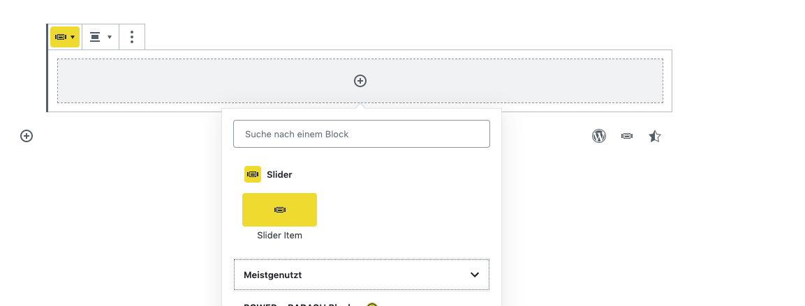

# Innerblocks

### Innerblocks \| Basics

Falls man Elemente und der gleichen einfach wie möglich Wiederholungen von Blocks vornehmen möchte, gibt es da seitens Gutenberg eine geniale Funktion. Diese heißen Innerblock. Am meisten zu erkennen an diesem Zeichen


Hier ein Beispiel eines Sliders. Wir haben hier einen Slider **Innerblock**. Mithilfe der Innerblocks bauen wir die einzelnen Slides aus. Zwar ist die Lösung etwas für den User irritierend, dafür ist das ein klassisches WordPress Standard. 

#### **Zum Aktivieren von Innerblocks muss man folgendes machen: \| Edit function** 

```jsx
import { InnerBlocks } from '@wordpress/block-editor';

<section className="prwp-gutenberg-slider">
    <div className="prwp-gutenberg-slider__wrapper">
        <InnerBlocks 
            allowedBlocks={ ['core/headline', 'core/image', ] }
        />
    </div>
</section>
```

#### Save Funktion \| Ausgabe der Innerblocks

```jsx
<div>
    <InnerBlocks.Content />
</div>
```

### Child Blocks

Möchte man für den Slider eigene **Innerblocks** Items erstellen, die dann nur erscheinen, wenn man tatsächlich sich im Eltern Block befindet, kann man die Parent Funktion von Gutenberg nutzen. Hier ein Beispiel. Hier verwendet man das Attribut allowedBlocks, um spezifische Blöcke einfügen zu können. In meinen Fall nehme ich mein **Child Block**. 

```jsx
import { InnerBlocks } from '@wordpress/block-editor';

// Parent Block | Innerblocks
<section className="prwp-gutenberg-slider">
    <div className="prwp-gutenberg-slider__wrapper">
        <InnerBlocks 
            allowedBlocks={ ['prwp-blocks/slider-item'] }
        />
    </div>
</section>
```



Im **Child Block** setzt man einfach innerhalb der **Register Funktion** einfach diese neue Angabe hinzu: 

```jsx
// Einfach den Namespace des Parent Innerblocks hinzufügen
parent: [ 'prwp-blocks/slider' ] 
```

### Innerblocks & Dynamic Blocks

Da in Gutenberg gerne die **Dynamic Blocks** verwendet werden, um die Problematik seitens der Save Methode in Gutenberg zu umgehen, kann man diese ganz einfach innerhalb der **Dynamic Blocks** verwenden.  

```php
register_block_type('prwp-blocks/slider', array(
    'render_callback' => 'prwp_slider'
));

function prwp_slider( $attributes, $content ) { 

    ob_start(); ?> 
 
        <section class="prwp-gutenberg-slider">
            <div class="prwp-gutenberg-slider__container swiper-container">
                <div class="prwp-gutenberg-slider__wrapper swiper-wrapper">
                    <?php echo $content;?>
                </div>
            </div>
        </section>

<?php 
    $ret = ob_get_contents();
    ob_end_clean();

    return $ret;
}
```

Hier muss man zusätzlich innerhalb dem **Render Callback** einen zweiten Parameter mitgeben, damit die **Innerblocks** automatisch eingefügt werden. Man braucht keine Foreach oder der Gleichen. 

Einfach **$content** als Parameter in der Funktion anhängen und innerhalb des OB\_CleanUps einfach  
dann mit echo ausgeben. Und ihr seid fertig :\)  

Das schöne ist an dieser Methode: Es funktioniert ohne Probleme! Einen normalen Repeater wäre da besser gewesen bei einem einzigen Block. Allerdings so kommt man auch ans Ziel. 

