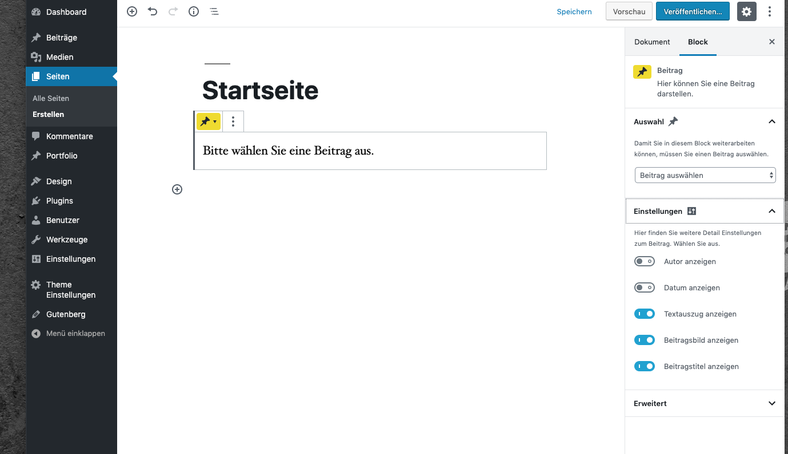
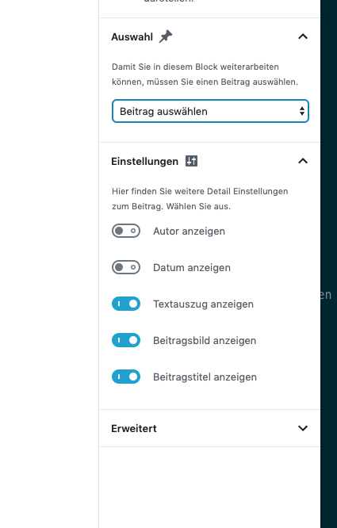
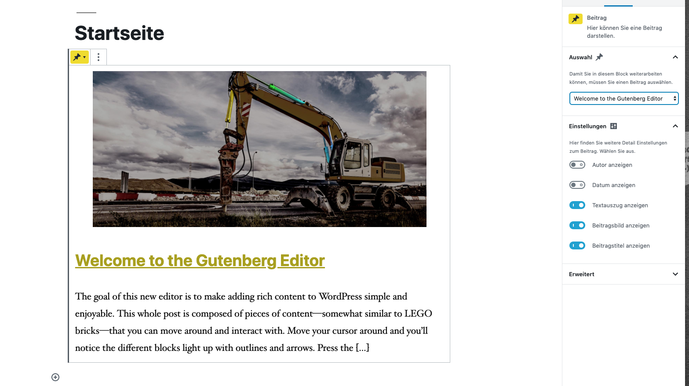
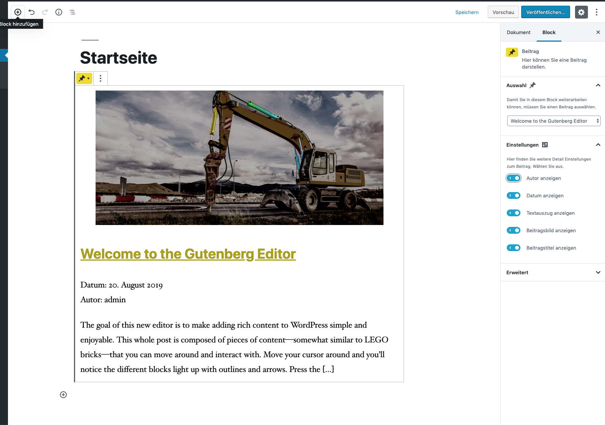

# Post Picker

**Vorerst kurze Info**: Dieser Schritt ist nicht für Einsteiger gedacht, denn hier arbeiten wir direkt mit der REST API und mit dem React DOM. 

Was sollen wir bauen? Kurz gesagt eine Auswahlliste und dieser Beitrag wird dann anschließend im Block dargestellt. Dies ist natürlich praktisch wenn man eine Team Auflistung machen möchte mit beliebiger Team Auflistung. 



Nach dem wir unseren Block registriert haben, müssen wir in PHP die WordPress REST API aktivieren. Dies tun wir so. Am besten direkt in der **functions.php** oder in deinem Plug-in.

```php
wp_enqueue_script( 'wp-api' );
```

Danach habe ich mir überlegt einen ServerSideRender zu tun, denn damit weiß der User automatisch bescheid, was Sache ist und welchen Beitrag der grade bearbeitet. 

Innerhalb meines Components erstelle ich mir eine State Methode wie in React üblich, dazu habe ich hier im Handbuch auch einen Beitrag geschrieben und kurz erklärt, wie man die Edit Funktion auslagern kann. 

### Posts herauslesen

Damit wir erstmal die gesamten Beiträge auslesen können, holen wir uns erstmal die gesamten Posts aus der API. Dies tun wir so: 

```jsx
getOptions() {
    return ( new wp.api.collections.Posts() ).fetch().then( ( posts ) => {
        this.setState({ posts });
	} );
}
```

### Werte in einem Objekt speichern

Was danach kommt ist wir erstellen uns eine Foreach Schleife und fügen alle benötigten Daten dort in einem Array bzw. eigentlich ein Objekt. 

```jsx
let options	= [ { value: 0, label: 'Beitrag auswählen' } ];

if( this.state.posts.length > 0 ) {
	this.state.posts.forEach((post) => {
		options.push( { value: post.id, label: post.title.rendered } );
	});
}
```

### Alle Beiträge in einer Auswahlliste 



Jetzt haben wir alles Nötige, um weiterzuarbeiten. Jetzt brauchen wir nur das SelectControl Component von Gutenberg und dort setzten wir die Options hinzu. also ein Label sowie einen Wert. 

Nicht zu vergessen, Attribute erstellen!! Sonst wird beim Auswählen keine PostID abgespeichert. Sie ist sehr wichtig, damit wir später weiterarbeiten können. 

```jsx
<SelectControl 
    onChange={ ( event )  => { setAttributes( { deinAtrr: event } )  }	} 
    value={ attributes.deinAtrr } 
    options={ options } 	
/>
```

Natürlich kannst du beliebig viele Components verwenden wie du Lustig bist, ist halt am Ende etwas Arbeit :D Ich wollte jetzt zum Beispiel den User die Möglichkeit geben, Dinge ausschalten bzw. einschalten zu können. 

### Die Ausgabe \| Render Funktion

Damit wir jetzt nun den Post Rendern können brauchen wir den ServerSideRender. Es ist eine Ansicht die für Edit und die Save Funktion gilt alle beide sehen gleich aus. Es ist halt eine Preview im Backend. 



Und wir sind bereit die Ausgabe zu betätigen. Aber mit diesem Code kommen wir nicht weiter. Wir müssen uns jetzt einen Dynamic Block erstellen. Wie üblich in PHP. 

```jsx
<ServerSideRender
    block="prwp-blocks/choose-post" // NameSpace vom Block
    attributes={ {
        // Importiere deine Attribute 
    	deinAttr : attributes.deinAttr 
    } }
/>
```

Jetzt in deiner PHP Funktion: 

```php
register_block_type('deinnamespace', array(
    'render_callback'   => 'rendering',
    'attributes'        => array(
       // Importiere alle deine Attribute
    )
));


function rendering() {
 ob_start(); ?>

    <section class="prwp-gutenberg-choosepost">
        <div class="prwp-gutenberg-choosepost__wrapper">
            <?php 
                if( $attributes['selectedPost'] == 0 ) {
                    echo 'Bitte wählen Sie eine Beitrag aus.';
                } else {
                    $args = array(
                        'post_type'      => array( 'post' ),
                        'posts_per_page' => 1, 
                        'p'  => $attributes['selectedPost'], 
                    );
                    $query = new WP_Query( $args );

                    if ( $query->have_posts() ) {
                        while ( $query->have_posts() ) {
                            $query->the_post(); ?>

                                <div class="prwp-gutenberg-choosepost__item">

                                    <?php if( $attributes['showPostImage'] ) { ?>
                                        <figure class="prwp-gutenberg-choosepost__image">
                                            <?php echo get_the_post_thumbnail(); ?>
                                        </figure>
                                    <?php }
                                        
                                        if( $attributes['showPostTitle'] ) { ?>
                                            <h3 class="prwp-gutenberg-choosepost__headline">
                                                <a class="prwp-gutenberg-choosepost__headline__link" href="<?php the_permalink(); ?>">
                                                    <?php the_title(); ?>
                                                </a>
                                            </h3>
                                    <?php } 
                                        
                                        if( $attributes['showDate'] || $attributes['showAuthor'] ) { ?>
                                        
                                            <div class="prwp-gutenberg-choosepost__details">
                                                <?php if( $attributes['showDate'] ) { ?>
                                                    <div class="prwp-gutenberg-choosepost__details__date">
                                                        <span>
                                                            Datum: <?php the_date(); ?>
                                                        </span>
                                                    </div>
                                                <?php } 
                                                    
                                                    if( $attributes['showAuthor'] ) { ?>
                                                    <div class="prwp-gutenberg-choosepost__details__author">
                                                        <span>
                                                            Autor: <?php the_author(); ?>
                                                        </span>
                                                    </div>
                                                <?php } ?>
                                            </div>

                                    <?php } 
                                        
                                        if( $attributes['showExcerpt'] ) { ?>
                                            <article class="prwp-gutenberg-choosepost__content">
                                                <?php the_excerpt(); ?>
                                            </article>
                                    <?php } ?>

                                </div>
                <?php  }
                    } else {
                        echo 'Es wurden keine Beiträge gefunden.';
                    }
                    wp_reset_postdata();
                }
            ?>
        </div>
    </section>

<?php   
    $ret = ob_get_contents();
    ob_end_clean();

    return $ret;
}
```

Nicht schwer oder? Wichtig dabei ist einfach nur, dass wir die PostID im Query mitgeben, dann läuft dies theoretisch von alleine. 

```php
 $args = array(
   'post_type'      => array( 'post' ),
   'posts_per_page' => 1, 
   'p'  => $attributes['deineAttributeMitDerID'], 
 );
 
 $query = new WP_Query( $args );
```



Und hier der gesamte Code im Beispiel:

**Deine Index.js File**

```jsx
import './style.scss';
import attributes from './globals/attributes';
import edit from './globals/edit';

// Define Variables
import { __ } from '@wordpress/i18n'; 
import { registerBlockType } from '@wordpress/blocks';

registerBlockType( 'namespace', {
	title: __('Beitrag'), 
	description: 'Hier können Sie eine Beitrag darstellen.',
	category: 'category',
	icon: {
		background: '#f0dd00',
		foreground: '#222832',
		src: 'admin-post'
	},
	keywords: [
		__( 'auswahl' ),
		__( 'choose' ), 
		__( 'Auswahl' )
	],
	supports: {
        html: false,
    },
	attributes,
	edit,
	
	save: ( props ) => {
		return null
	}
});
```

```jsx
const attributes = {
    selectedPost: {
        type: 'number',
        default: 0
    }, 
    showAuthor: {
        type: 'boolean',
        default: false
    }, 
    showDate: {
        type: 'boolean', 
        default: false
    }, 
    showExcerpt: {
        type: 'boolean', 
        default: true
    },
    showPostImage: {
        type: 'boolean', 
        default: true
    }, 
    showPostTitle: {
        type: 'boolean', 
        default: true
    }
}
export default attributes;
```

**Deine Edit.js**

```jsx
import { InspectorControls } from '@wordpress/block-editor';
import { Component, Fragment } from '@wordpress/element';
import { PanelBody, SelectControl, ServerSideRender, ToggleControl } from '@wordpress/components';

class edit extends Component {

    static getInitialState() {
		return {
			posts: [],
			selectedPost: 2,
		};
	}

	constructor() {
		super( ...arguments );
		this.state 				= this.constructor.getInitialState();
		this.getOptions 		= this.getOptions.bind(this);
		this.onChangeSelectPost = this.onChangeSelectPost.bind(this);	
	}
	
	// Get Data
	getOptions() {
        return ( new wp.api.collections.Posts() ).fetch().then( ( posts ) => {
            this.setState({ posts });
		} );
	}

	componentDidMount() {
		this.setState( { selectedPost: this.props.attributes.selectedPost } );
		this.getOptions();
	}

	// OnSelect Post > Save Post ID 
	onChangeSelectPost( value ) {
		this.props.setAttributes( { selectedPost: parseInt( value ) } )
		this.setState( { selectedPost: parseInt( value ) } );
	}

	render() {
		let selectedPost 	= {};
		let options		 	= [ { value: 0, label: 'Beitrag auswählen' } ];
		let attributes 		= this.props.attributes; 
		let selectPostID 	= attributes.selectedPost; 


		// Push data in object
		if( this.state.posts.length > 0 ) {
			this.state.posts.forEach((post) => {
				options.push( { value: post.id, label: post.title.rendered } );
			});
		}

		return [
			<Fragment>
				<InspectorControls>
					<PanelBody 
						title="Auswahl"
						icon="admin-post"
						initialOpen={ true }>
					
							{ options.length < 2 ? 

									<Fragment>
										<h4>Bitte legen Sie einen Beitrag an.</h4>
										<p>Es wurden keine Beiträge gefunden.</p>
									</Fragment>

								: 

									<Fragment>
										<p>
											<small>
												Damit Sie in diesem Block weiterarbeiten können, müssen Sie einen Beitrag auswählen.
											</small>
										</p>
										<SelectControl 
											onChange={ this.onChangeSelectPost	} 
											value={ selectPostID } 
											options={ options } 	
										/>
									</Fragment>
							}

					</PanelBody>

					{ options.length > 1 ? 
						
							<PanelBody 
								title="Einstellungen"
								icon="admin-settings"
								initialOpen={ false }>
									<p>
										<small>
											Hier finden Sie weitere Detail Einstellungen zum Beitrag. Wählen Sie aus.
										</small>
									</p>
									<ToggleControl
										label="Autor anzeigen"
										checked={ attributes.showAuthor }
										onChange={ ( bool ) => { this.props.setAttributes( { showAuthor: bool } )  } }
									/>
									<ToggleControl
										label="Datum anzeigen"
										checked={ attributes.showDate }
										onChange={ ( bool ) => { this.props.setAttributes( { showDate: bool } )  } }
									/>
									<ToggleControl
										label="Textauszug anzeigen"
										checked={ attributes.showExcerpt }
										onChange={ ( bool ) => { this.props.setAttributes( { showExcerpt: bool } )  } }
									/>
									<ToggleControl
										label="Beitragsbild anzeigen"
										checked={ attributes.showPostImage }
										onChange={ ( bool ) => { this.props.setAttributes( { showPostImage: bool } )  } }
									/>
									<ToggleControl
										label="Beitragstitel anzeigen"
										checked={ attributes.showPostTitle }
										onChange={ ( bool ) => { this.props.setAttributes( { showPostTitle: bool } )  } }
									/>
							</PanelBody>

						: '' 
					}

				</InspectorControls>

				{ options.length > 1 ? 

						<ServerSideRender
							block="prwp-blocks/choose-post"
							attributes={ {
								selectedPost	: 	attributes.selectedPost, 
								showDate		: 	attributes.showDate, 
								showPostTitle	: 	attributes.showPostTitle, 
								showPostImage	: 	attributes.showPostImage, 
								showExcerpt		: 	attributes.showExcerpt, 
								showAuthor		: 	attributes.showAuthor
							} }
						/>

					: 'Bitte legen Sie einen Beitrag an.'
				}

			</Fragment>
		];
	}
    
}
export default edit; 
```

Deine PHP 

```php
<?php 
register_block_type('prwp-blocks/choose-post', array(
    'render_callback'   => 'prwp_choosepost',
    'attributes'        => array(
        'selectedPost'  => array(
            'type'      => 'number', 
            'default'   => 0
        ), 
        'showAuthor'  => array(
            'type'      => 'boolean', 
            'default'   => false
        ),
        'showDate'  => array(
            'type'      => 'boolean', 
            'default'   => false
        ),
        'showExcerpt'  => array(
            'type'      => 'boolean', 
            'default'   => true
        ),
        'showPostImage'  => array(
            'type'      => 'boolean', 
            'default'   => true
        ),
        'showPostTitle'  => array(
            'type'      => 'boolean', 
            'default'   => true
        )
    )
));

function prwp_choosepost( $attributes ) {
    ob_start(); ?>

    <section class="prwp-gutenberg-choosepost">
        <div class="prwp-gutenberg-choosepost__wrapper">
            <?php 
                if( $attributes['selectedPost'] == 0 ) {
                    echo 'Bitte wählen Sie eine Beitrag aus.';
                } else {
                    $args = array(
                        'post_type'      => array( 'post' ),
                        'posts_per_page' => 1, 
                        'p'  => $attributes['selectedPost'], 
                    );
                    $query = new WP_Query( $args );

                    if ( $query->have_posts() ) {
                        while ( $query->have_posts() ) {
                            $query->the_post(); ?>

                                <div class="prwp-gutenberg-choosepost__item">

                                    <?php if( $attributes['showPostImage'] ) { ?>
                                        <figure class="prwp-gutenberg-choosepost__image">
                                            <?php echo get_the_post_thumbnail(); ?>
                                        </figure>
                                    <?php }
                                        
                                        if( $attributes['showPostTitle'] ) { ?>
                                            <h3 class="prwp-gutenberg-choosepost__headline">
                                                <a class="prwp-gutenberg-choosepost__headline__link" href="<?php the_permalink(); ?>">
                                                    <?php the_title(); ?>
                                                </a>
                                            </h3>
                                    <?php } 
                                        
                                        if( $attributes['showDate'] || $attributes['showAuthor'] ) { ?>
                                        
                                            <div class="prwp-gutenberg-choosepost__details">
                                                <?php if( $attributes['showDate'] ) { ?>
                                                    <div class="prwp-gutenberg-choosepost__details__date">
                                                        <span>
                                                            Datum: <?php the_date(); ?>
                                                        </span>
                                                    </div>
                                                <?php } 
                                                    
                                                    if( $attributes['showAuthor'] ) { ?>
                                                    <div class="prwp-gutenberg-choosepost__details__author">
                                                        <span>
                                                            Autor: <?php the_author(); ?>
                                                        </span>
                                                    </div>
                                                <?php } ?>
                                            </div>

                                    <?php } 
                                        
                                        if( $attributes['showExcerpt'] ) { ?>
                                            <article class="prwp-gutenberg-choosepost__content">
                                                <?php the_excerpt(); ?>
                                            </article>
                                    <?php } ?>

                                </div>
                <?php  }
                    } else {
                        echo 'Es wurden keine Beiträge gefunden.';
                    }
                    wp_reset_postdata();
                }
            ?>
        </div>
    </section>

<?php   
    $ret = ob_get_contents();
    ob_end_clean();

    return $ret;
}

```

