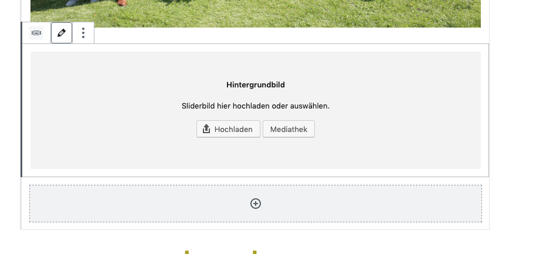

# Toolbar

Nehmen wir mal an du möchtest innerhalb der Toolbar die Möglichkeit anbieten direkte Funktionen mit einem Klick bedienbar machen. Dann eignet sich hier die hauseigene Gutenberg Toolbar an. Einfach und extrem schnell umsetzbar.   



### Dependencies aktivieren 

Damit wir loslegen können, musst du vor der Register Funktion einfach nur dieses Snippet einfügen. 

```jsx
import { MediaUpload, BlockControls } from '@wordpress/block-editor';
import { Toolbar, IconButton } from '@wordpress/components';
```

### Edit Funktion

Damit wir nun den Button mit Klick Funktion anpassen können, kannst du ganz einfach innerhalb des Return Befehls dies reinsetzen. Mantel diesen Code am besten mit einem Fragment oder der Kurzschreibweise &lt;&gt; .... &lt;/&gt; 

```jsx
<BlockControls>
    <Toolbar>
        <MediaUpload 
            onSelect = { ( image ) => { setAttributes( { image: image.url } ) } }
            value={ attributes.image }
            render={ ( { open } ) => (
                <IconButton
                    icon="edit"
                    onClick={ open }
                />
            ) }
        />
    </Toolbar>
</BlockControls>
```

Wichtig ist nur, dass du dir die Attribute angelegt hast und mit denen wie gewohnt arbeitest. React Verständnis wird hier erwartet. 

**Done! That's it :\)** 

