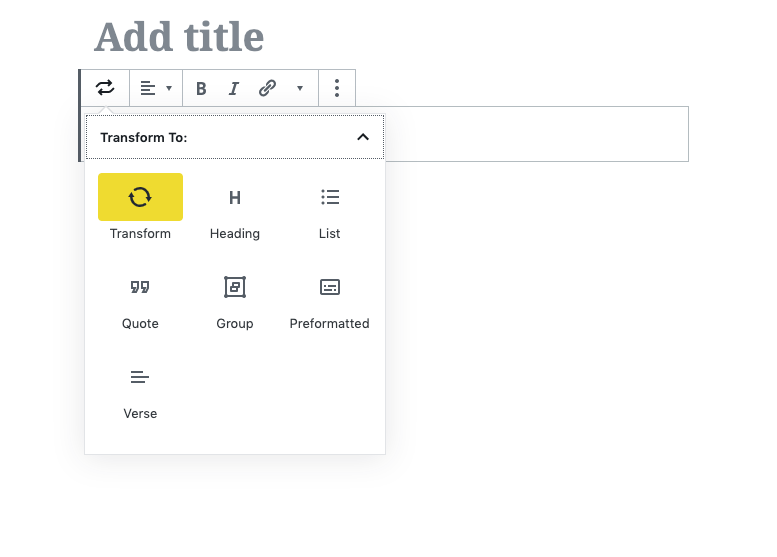

# Transform

Bei Gutenberg sieht man oft das Umwandeln Tool beim Auswählen eines Blocks. Diese Funktion macht die Arbeit in Gutenberg unheimlich effizient für die Redaktion. 



### Let's code!

Innerhalb deines Blocks fügst du diese Zeilen Code hin. Danach erkläre ich dir das Schritt für Schritt. 

```jsx
// Dependencies 
import { registerBlockType } from '@wordpress/blocks';
import { __ } from '@wordpress/i18n'; 
import { TextControl } from '@wordpress/components';
import { Fragment } from '@wordpress/element';
import { createBlock } from '@wordpress/blocks';

// Füge dies innerhalb deiner registerBlockType() Funktion hinzu
transforms: {

    // Anderen Block in unseren jetzigen umwandeln.
    from: [
        {
            type: 'block',
            blocks: [ 'core/paragraph', 'core/heading' ],

            transform: ( { content } ) => {
                return createBlock( 'prwp-blocks/transform', {
                    headline: content
                } );
            },
        },

        // Shortcut erstellen / Space(Leerzeichen) danach drücken
        {
            type: 'prefix', 
            prefix: '#prwp', 
            transform: ( ) => {
                return createBlock( 'prwp-blocks/transform');
            }
        }
    ], 

   // Jetzigen Block in einem anderen Block umwandeln
   to: [
        {
            type: 'block',
            blocks: [ 'core/heading', 'core/paragraph' ],
            transform: ( { headline } ) => {
                return(
                    createBlock( 'core/heading', {
                        content: headline
                    }), 
                    createBlock('core/paragraph', {
                        content: headline
                    })
                )
            },
        }
    ]
 },
```

Bei dieser Funktion kannst du den Zustand aller Blöcke beeinflussen und deinen jetzigen Block quasi registrieren. Die sogenannten Namespaces habe ich dir alle unter [**Standardblocks**](../blocks/standardblocks.md) definiert.  
Innerhalb des Codes kannst du gerne die Kommentare lesen, die dir das Lesen erleichtert.   

