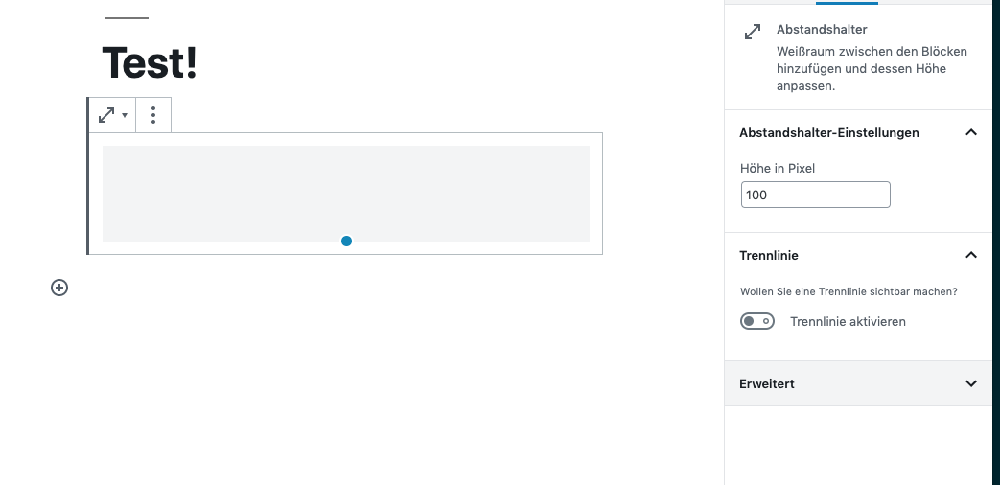
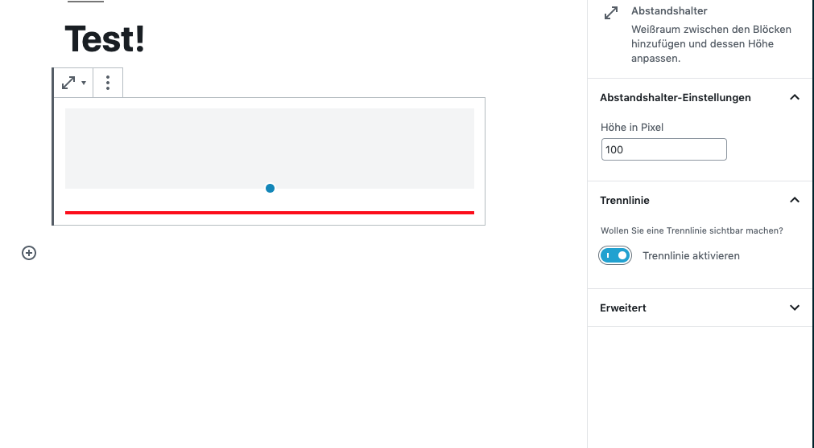

# Vorhandene Blöcke bearbeiten



### Attribute

Als Erstes müssen wir wissen welchen Block wir bearbeiten wollen und welche Einstellungen wir extra benötigen. Wie gewohnt funktioniert das Hook System von React wie damals in PHP. 

Diese Methode mit dem Extend wird Dank dem React HighOrderComponent ermöglicht. Weitere Informationen findest du hier.   


Ich wollte zum Beispiel eine Trennlinie hinzufügen zum Abstand Block. Als Erstes habe ich mir alle vorhandenen Attribute ausgeben lassen. Gehe dazu im Backend und füge deinen gewünschten Block hinzu. Und gebe folgenden Snippet in deiner JavaScript Konsole ein. 

```javascript
wp.data.select('core/block-editor').getBlocks();
```

So jetzt wissen wir welche **Attribute** verfügbar sind. Mit diesen können wir ganz einfach weiterarbeiten. Damit ich aber eine neue Attribute hinzufügen kann, muss ich folgendes tun, damit meine Änderungen gespeichert werden. 

1. Importiere dir alle Dependencies  

```jsx
import { createHigherOrderComponent } from '@wordpress/compose';
import { Fragment } from '@wordpress/element';
import { InspectorControls } from '@wordpress/block-editor';
import { PanelBody, ToggleControl } from '@wordpress/components';
```

  2. Code anpassen & Block zuweisen \| **blocks.registerBlockType**

```jsx
function spacerAttr( props ) {
    if( props.name === 'core/spacer' && props.hasOwnProperty('attributes') ){
    
        // Add Attr -> Diver 
        props.attributes.trenner = {
            type: 'boolean',
            default: false
        };
    }
    return props;
} 
wp.hooks.addFilter('blocks.registerBlockType', 'prwp/spaceractive', spacerAttr );
```

### Backend Einstellungen anpassen \| editor.BlockEdit 

Jetzt können wir schon experimentieren im Backend. Hier musst du ebenfalls einen Hook aktivieren und mit denen weiterarbeiten. Mit dem Hook editor.BlockEdit kannst du die gesamte Ansicht im Backend manipulieren. 

In dem HighOrderComponent musst du zwingend einen Parameter mitgeben, sonst werden die anderen Inhalte vom Core Block nicht extended! Danach musst du einfach an einer Stelle deiner Wahl den Inhalt kopieren mittels JS. 

```jsx
<BlockEdit { ...props } />
```

Hier zur Verdeutlichung: 

```jsx
const override =  createHigherOrderComponent( ( BlockEdit ) => {
    return ( props ) => {
        return (
            <Fragment>
                <section className={ props.attributes.trenner === true ? 'prwp-gutenberg-trenner--open' : 'prwp-gutenberg-trenner' }>
                    <BlockEdit { ...props } />
                </section>
                <InspectorControls>
                    <PanelBody title="Trennlinie">
                        <p>
                            <small>
                                Wollen Sie eine Trennlinie sichtbar machen?
                            </small>
                        </p>
                        <ToggleControl
                            label="Trennlinie aktivieren"
                            checked={ props.attributes.trenner }
                            onChange={ ( boolean ) => {
                                props.setAttributes({
                                    trenner: boolean
                                }); 
                            }}
                        />
                    </PanelBody>
                </InspectorControls>
            </Fragment>
        );
    };
}, "withInspectorControl" );
 
wp.hooks.addFilter( 'editor.BlockEdit', 'core/spacer', override );
```

### Render / Save Funktion überschreiben

Damit wir die Save Funktion überschreiben können wird empfohlen hier Dynamische Blöcke zu verwenden.  Hier ist es ziemlich einfach, quasi das selbe Spiel wie man gewohnt ist von den Dynamic Blocks. Wichtig ist, dass man weiß, wie die Attribute heißen. Den Code Snippet findest du ganz oben  ausführlich erklärt. 

```php
function prwp_seperator_override() {
	register_block_type( 'core/spacer', array(
        'render_callback' => 'prwp_seperator_override_render',
        'attributes'      => array(
            'trenner' => array(
                'type'    => 'boolean', 
                'default' => false
            ), 
            'height' => array(
                'type'    => 'integer', 
            )
        ), 
	) );
}
add_action( 'init', 'prwp_seperator_override' );


// Render 
function prwp_seperator_override_render( $attributes ) {
    ob_start(); ?> 

        <div <?php if( $attributes['height'] ) echo 'style="height: '. $attributes['height'] .'px " ' ?>
            class="prwp-gutenberg-driver <?php if( $attributes['trenner'] ) echo 'prwp-gutenberg-trenner--open' ?>">
        </div>
<?php  
    // Clean UP 
    $ret = ob_get_contents();
    ob_end_clean();

    return $ret;
} 
```

Und wir sind fertig :\) 



